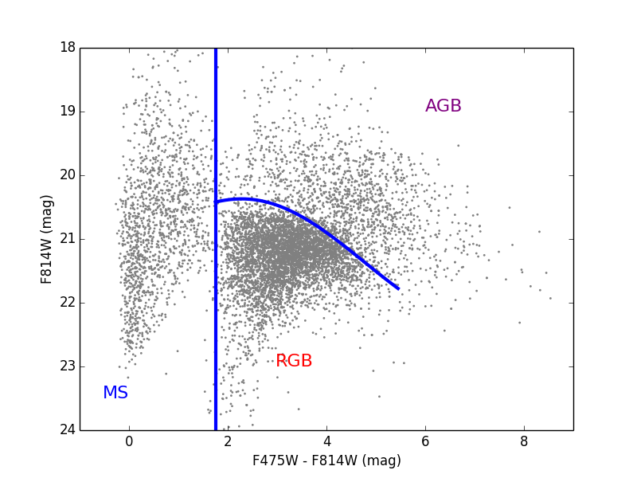
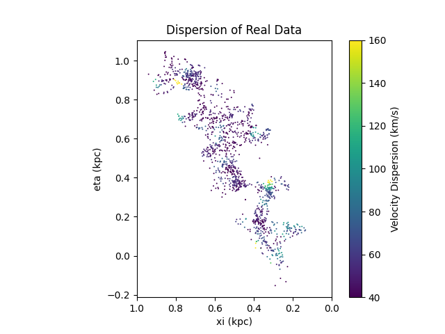
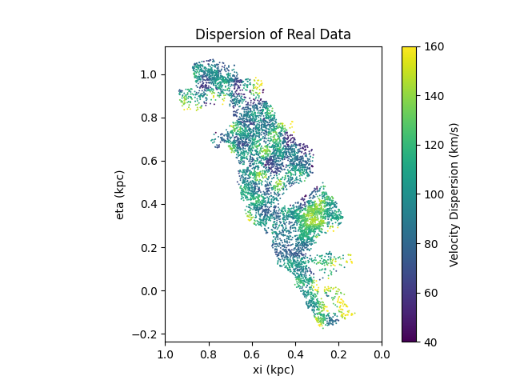

# UCSC Python and Research (PYaR) — Computational Astrophysics

This repository contains completed research analysis notebooks completed through the UC Santa Cruz Python and Research (PYaR) initiative. 

### Focus Areas
- **Galactic Kinematics & Evolution:** Modeled stellar disk dynamics, Doppler shifts, and the satellite bombardment history of the Andromeda Galaxy (M31).
- **Data Source:** Analyzed research-grade spectroscopic and photometric datasets from the Hubble Space Telescope's Panchromatic Hubble Andromeda Treasury (PHAT) survey.
- **Scientific Computing Stack:** Python, NumPy, SciPy, Matplotlib, and Jupyter for spectral analysis and velocity distribution visualization.

## Key Visualizations & Findings

### 1. Photometric Population Selection (Color-Magnitude Diagram)
Modeled stellar populations from Hubble PHAT photometry ($F475W - F814W$ color index vs. $F814W$ magnitude) to isolate distinct evolutionary stages: Main Sequence (MS), Red Giant Branch (RGB), and Asymptotic Giant Branch (AGB).

  

---

### 2. Spatial Velocity Dispersion & Kinematic Heating
Derived kinematic maps ($\xi$ vs. $\eta$ spatial coordinates in kpc) showing velocity dispersion across different stellar populations:

| Main Sequence (Young / Dynamically Cold) | Red Giant Branch (Older / Dynamically Heated) |
| :---: | :---: |
|  |  |
| *Low dispersion (~40–60 km/s)* | *Elevated dispersion (~100–140+ km/s)* |

> **Kinematic Analysis:** Asymptotic Giant Branch stars (`plots/AGB_dispersion_map.png`) and RGB stars demonstrate significant kinematic heating compared to Main Sequence populations, reflecting Andromeda's merger and satellite accretion history.
